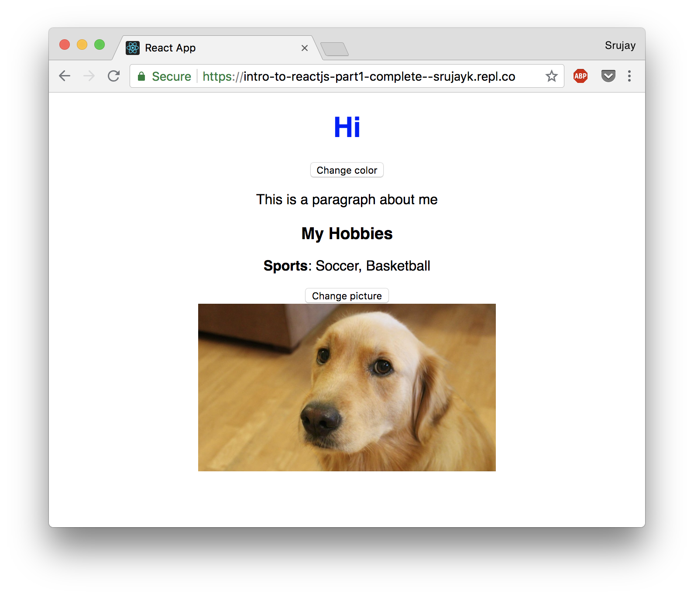

# Intro to ReactJS

_**We recommend going through this workshop in Google Chrome.**_

**What we're going to building**: A basic portfolio website



**Prerequisites**: HTML and CSS

**What you'll learn in this workshop**: Basic JavaScript, React (JSX, components, props, and state)

**How long this workshop will take**: 1 hour

ReactJS, or React, is a JavaScript library for building user interfaces for web applications. In this workshop, we'll be using it to build a basic portfolio site. Let's go!

[Live Demo/Final Code](https://repl.it/@srujayk/Intro-to-ReactJS-Part1-Complete)

**Table of contents:**

- [Part I: Setup](#part-i-setup)
- [Part II: Basic JavaScript](#part-ii-basic-javascript)
- [Part III: JSX](#part-iii-jsx)
- [Part IV: Components](#part-iv-components)
- [Part V: props](#part-v-props)
- [Part VI: state](#part-vi-state)
- [Part VII: Hacking](#part-vii-hacking)

## Part I: Setup

Let's set up your coding environment! Head over to [Repl.it](http://repl.it) and create an account or log in.

Then, go to [this Repl](https://repl.it/@srujayk/Intro-to-ReactJS-Part1), which contains some basic starter code for this workshop. Click the **fork** button near the top menu to create a copy of this code that you can start editing.

A brief explanation of the lines that are given to you:

```js
import React from 'react';
import ReactDOM from 'react-dom';
import './index.css';
```
These lines import the `React` and `ReactDOM` packages for you to use. They provide you with some necessary functions/classes we'll need. It also imports the CSS file that will be used in your project.

```js
ReactDOM.render(<p></p>, document.getElementById('root'));
```
This line is what passes the code you write from JavaScript onto your HTML page. The first input to the `ReactDOM.render` function is a piece of JSX code, which is basically HTML that can be written in a JavaScript file. JSX will be explained more in the next part of this workshop. The second input is where on the HTML page your JSX will be shown, in this case an element with the id `root`. Unfortunately, we can't see the HTML file in Repl, so just imagine that the HTML file looks like this:

```html
<!DOCTYPE html>
<html>
    <head>
        <title>Some random title</title>
        <link type="text\css" href="index.css" />
    </head>
    <body>
        <div id="root">
        </div>
    </body>
</html>
```
The `div` with the `id` of `"root"` is where your JSX will be shown.

Don't worry if all of that didn't make sense, it will soon. Now you're ready to start coding!

## Part II: Basic JavaScript

Here, I'm just going to list some syntax in JavaScript that you'll need to know for this
tutorial.

`const x = 3;`  The `const` keyword declares a constant variable. This particular one is a variable named `x` initialized with the value `3`.

`let y = ["1", "2", "3"];`  The `let` keyword declares a mutable, or changeable, variable. In this case, an array named `y` initialized with the string values `1, 2, and 3`.


```js
if (x === 3) {
    console.log("x is 3!");
} else {
    console.log("x isn't 3!");
}
```
This is an `if` statement, which is used to have code run only under certain conditions. In the example above, `if` `x` is equal(`===`) to `3`, then the block of code in the first set of curly braces is run. Otherwise, the code inside the `else` braces is run.

```js
class Hi {    
    sayHi(name) {
        return `Hi ${name}`;
    }
}
```
This creates a class named `Hi` that has one method called `sayHi`. This method takes in an input called `name`. This method then `returns` a string that says `Hi *name*`. Don't worry if all of that didn't make sense.

And that's it. That's pretty much all the JavaScript you really need to know to write your
first React application.

## Part III: JSX

### HTML

You've seen HTML before. It basically works like this: you have different tags, each
of which does something different, and these tags are nested. There are different
variations on tags, like self-closing, and they can have attributes. Here's an example of HTML that has all of these things:

```html
<div class="root">
    <h1>Hi there!</h1>
    <p>Here's a picture of a dog!</p>        
    
</div>
```

### JSX

Basically, JSX is HTML that you can write in your JavaScript code. For example, saying something like the following is allowed with JSX.

`const myHeader = <h1>Hello!</h1>;`

This creates a variable named `myHeader` that is equal to a JSX object. Being able to put HTML into our JavaScript is how we will be able to make templates in React.

### **Exercise 1**

Let's try writing some JSX. In line 4, replace `<p></p>` with `<h1>Hi</h1>`, and let the page refresh. You can see that the page on the right now says the word "Hi". You should now understand what `ReactDOM.render` does; it renders the JSX (which is basically HTML) inside the `div` element with the `id` equal to `"root"`.

Play around with it, adding different HTML elements into this first slot.


## Part IV: Components

React is all about components. Basically what a component is is a building block in your code. They are reusable elements, so you can create, for example, the structure for a button, one time, and make 50 buttons on your page.

Add the following code underneath the import statements, but above the `ReactDOM.render` call:

```js
class Header extends React.Component {

}
```

This created an empty component called `Header`. Now, on line 7, replace `<h1>Hi</h1>` with `<Header />`. This is how you initialize a component: like a self-closing HTML tag, but with the component name as the tag name.

Unfortunately, our screen now gives us an error. This is because our component isn't complete yet: it's empty! Add the following lines in between the curly braces of your class:

```js
render() {
    return <h1>Hi</h1>;
}
```

Every component requires a `render` method. The `render` method is used to describe the UI for our component. When the component is initialized (using `<Header />`), the component class's `render` method is automatically called, and whatever is returned is passed into `ReactDOM.render`'s first input as JSX.

React's key feature is that components are reusable. Now that you've created this `Header` component, we should be able to reuse it super easily. Below the `Header` component, but above the `ReactDOM.render` call, add the following lines:

```js
const multiHeaders = (<div>
                        <Header />
                        <Header />
                    </div>);
```

Two new rules are introduced in the code above:

1. **Parentheses around multi-line JSX statements:**
    It is good practice whenever you're writing JSX that spans multiple lines to put parentheses around it. This is also required whenever you write multi-line JSX in the `return` statement of a component's `render` method.

2. **Single enclosing tag for adjacent JSX statements:**
    All JSX code must have a single tag that encloses all of its elements. In this case, it is the `div` tag that encloses the two `Header` component tags, which would otherwise be on the same level.


Now, change the first input to `ReactDOM.render` to this variable, `multiHeaders`, and watch the page reload. Your code should now say `ReactDOM.render(multiHeaders, document.getElementById('root'));`.  Now there are two headers, without having to write `<h1>Hi</h1>` over again! In this case, it wasn't much code that we avoided, but imagine having to repeat 100s of lines of code. Components are really powerful.

### **Exercise 2**

Delete the `multiHeaders` variable we created before.

Then, create a new component called `Profile`. Follow the structure of the `Header` component, and in the `return` line of the `render` function, add 3 elements: the `Header` component we had before, a `p` (paragraph) tag with a brief summary of yourself, and an `img` (image) tag with a picture of a funny/cool picture from Google Images.

Don't forget the two rules about JSX code formatting introduced above. Any multi-line JSX statements that go in this `return` statement must be enclosed with parentheses. Also, in order to have multiple JSX tags at the same level (`Header`, `p`, and `img`), all of them must be enclosed within one single parent tag. So, once you've created the elements, place them inside a `div` that encloses all 3.

Finally, change the first input to the `ReactDOM.render` method to initialize this new `Profile` component.

---
***Stuck?***

Your code should look something like this:
```js
class SomeComponent extends React.Component {
    render() {
        return (<div>
                    <Header />
                    <p>This is a paragraph.</p>
                    ...
                </div>);
    }
}

ReactDOM.render(<SomeComponent />, ...);
```
That's not all of it, but it's enough to get you started. If you're having trouble using the `img` tag and it's attributes, go [here](https://www.w3schools.com/tags/tag_img.asp). Make sure that when you're copying the image URL from online, you're clicking *Copy Image Address*, not *Copy Link Address*.

---

Great! We now have a page with an image, a paragraph, and a header. One problem: it doesn't look great. Head over to the `index.css` file, and let's make this look better.

Let's make our everything center-justified like this:
```css
* {
    text-align: center;
}
```

To format our image properly, add the following code to your CSS:

```css
img {
    width: 50%;
    display: block;
    margin-left: auto;
    margin-right: auto;
}
```
Feel free to add any more stylish things (colors, fonts, etc) you want before we move onto the next section.

## Part V: props

Props is short for properties, and it allows you to pass inputs into your components. Components wouldn't be as useful if you just had the same code over and over. The way we'd pass inputs into a component is the same way you use attributes in HTML.

For example, lets say we wanted to modify our `Header` component to say "Hi, *name inputted*!". We would pass a *prop* into our `Header` component by setting an attribute of `name` when we instantiate it. The code would look like this:

```html
<Header name="your name" />
```

Then, to use this inputted name in our `Header` component, we would modify it to look like this:

```js
class Header extends React.Component {
  render() {
    return <h1>Hi, {this.props.name}</h1>;
  }
}
```
Let's break down the different parts of `this.props.name`:

1. `this` is a keyword in JavaScript that allows you to access data that's a part of the current component you're in. Whether you're inside your `Header` component or your `Profile` component, `this` would give you access to their respective data.

2. `this.props` is where the props of the current component are stored.

3. `this.props.name` is how we refer to a `prop` of `this` component that is called `name`.

This is JavaScript Object Notation, if you've heard of that before. Don't worry if you haven't.

The reason for the curly braces around it is this is how we use JavaScript code within our JSX. For example, if we typed something like `<h1>I am 1 + 16 years old.</h1>` in JSX, it would display as ***I am 1 + 16 years old***. But, by placing the curly braces around the `{1 + 16}` (making the code `<h1>I am {1 + 16} years old.</h1>`), it would display as ***I am 17 years old.*** JavaScript can do the math, JSX can't.

### **Exercise 3**

Let's practice using props by making a new component called `Hobby`.

`Hobby` should follow the same structure as `Header`, but it should have two props, `category` and `list`. These will later be used for taking in the `Hobby`'s category, and the list of actually hobbies in that category.

Use both of these props in a single line, in the format "`category`: `list`", with the `category` in bold. For example, "**Sports**: football, basketball".

Then, in your `Profile` component, add `<h3>My Hobbies</h3>` after the `</p>` tag of the paragraph you wrote before.

After that, make 3 new `Hobby` elements underneath your "My Hobbies" heading, with the two props from above. `category` should be a single word string, and `list` should be a single string with each hobby name separated by commas.

Remember the rule about multi-line JSX `return` statements from before, and the [strong](https://www.w3schools.com/TAgs/tag_strong.asp) tag in HTML might come in handy.

---
***Stuck?***

Your code for `Hobby` should look something like this:
```js
class SomeComponent extends React.Component {
  render() {
    return (<div>
              <p><strong>{this.props.firstProp}</strong>: this.props.secondProp}</p>
            </div>);
  }
}
```

Your code in `Profile` should be along the lines of:
```js
class Profile extends React.Component {
  render() {
    return (<div>
              ...
              <p> This is a paragraph about me</p>
              <h3>My Hobbies</h3>
              <SomeComponent firstProp="..." secondProp="..." />
              <SomeComponent firstProp="..." secondProp="..." />
              <SomeComponent firstProp="..." secondProp="..." />
              ...
            </div>);
  }
}
```

---

Great! Now we know how to pass properties into our components to make them more useful.

## Part VI: state

State is another important concept for React components. It's like props in that it allows you to make your components more dynamic, but there's one key difference: props are passed into a component from a different component, while state is managed by the component itself.

An example of props vs. state is while `name` would be something passed into a component, something like `color` could be managed by the component itself.

Let's add a state to our `Header`. To start off, in the curly braces for the class, *before* the `render` method, add the following code:

```js
constructor(props) {
    super(props);
}
```
Don't worry about this means, think of it as a formality we need to go through to add a state. Now, underneath the line `super(props);`, we're going to add a state. Add:

```js
this.state = {};
```
`this.state` is a JavaScript object that can store some data for us. It stores *key-value pairs*. This means that to store an attribute for our header called `color`, which we want to be `blue`, `color` is the *key* and `blue` is the *value*. We would do it like this:

```js
this.state = { color: "blue" };
```
The way we access this data from our state is very similar to how we accessed props. If we wanted to access a prop called `name` in our component, we would use `this.props.name`. Similarly, if we want to use `color` from `this.state`, we would use `this.state.color`.

We can now actually implement this color in our `Header`. Add an `style` attribute to the `h1` tag in `Header`, and set it equal to `{{color: this.state.color}}`. The line should now look like this:

```js
return <h1 style={{color: this.state.color}}>Hi</h1>;
```

This sets the `color` property of the `style` attribute of our `h1` tag to the value stored in `this.state.color`, which is `blue`. If you refresh, your header text should now be blue!

What if we now wanted to change the state? Let's say in this case, we want the `Header` text to change to green if we click a button. To do this, we need to make a helper method in JavaScript that will do this for us.

```js
changeColor() {
    if (this.state.color === 'blue') {
        this.setState({ color: 'green' });
    } else {
        this.setState({ color: 'blue' });
    }
}
```

This code might look complicated, but it's not too bad. Basically, it checks `if` the current color stored in `this.state.color` is equal to `blue`. If it is, it sets the `color` attribute of `this.state` to `green`. If `this.state.color` is not `blue`, it is assumed to be `green`, so in this case it goes to the `else` and sets the state back to `blue`.

To do this, it calls `this.setState()`. `this.setState` takes in a JavaScript object, with *key-value pairs* of the attributes you want to change. In this case, `{ color: 'blue' }` is a JavaScript object that is inputted to change `this.state.color` to blue.

This code in the box above needs to be placed **in between** the `constructor` and `render` methods, like so:

```js
class Header extends React.Component {
  constructor(props) {
    ...
  }

  changeColor() {
    ...
  }

  render() {
    ...
  }
}
```

Now, to get our method to work, add this line to the end of the constructor, after `this.state = {...};`:

```js
this.changeColor = this.changeColor.bind(this);
```
Don't worry about what this means for now, it's just so the component can access our method.

Now that our method is in the code, and the component can see the method, we're ready to add the toggle button.

```html
<button onClick={this.changeColor}>
    Change color
</button>
```
This is our `button`. Looking at it, it seems pretty intuitive. It's an HTML `button` that says **Change color** on it, and when clicked (set by the `onClick` attribute), calls our `changeColor` method.

If you're familiar with the `button` tag in HTML, you know that usually, the `onclick` attribute usually is all lowercase. However, in this code, `onClick` is actually a React *event* instead of the normal `button` attribute. Using this event instead lets us call JavaScript functions when this action occurs.

Add the code for the button in the `render` method of the `Header` component, after the closing `</h1>` tag. Remember the rules about formatting JSX code properly (see *Part IV: Components*).

We're done! On your screen, you should now see a button that, when clicked, *changes the state* of the heading to be either blue or green. All we have to do now is make it centered and look good. Add this style to `button` in `index.css`:

```css
button {
    display: block;
    margin-left: auto;
    margin-right: auto;
}
```

### **Exercise 4**

We just learned how to change the color of our header using `this.state`. Do you think you could figure out how to change our image when a button is clicked? See if you can follow the steps above to change the `src` attribute of the `img` tag in `Profile` using the same steps:

1. Add a constructor method to `Profile`
2. Set the initial `this.state` to the current image, and make sure the `img` tag is using the state to set it's `src`.
3. Make a method to change the value of `src` to something else. Don't forget to bind it like we did before (adding that last line to the `constructor`).
4. Add a button *above the image* that, when clicked, calls this method.

---
***Stuck?***

Your code for `Profile` should look something like this:
```js
class Profile extends React.Component {
  constructor(props) {
    ...
    this.state = { url: 'image url 1' };
    this.changeUrl = this.changeUrl.bind(this);
  }

  changeUrl() {
    if (this.state.url === 'image url 1') {
        this.setState({ url: 'image url 2' });
    } else {
        this.setState({ url: 'image url 1' });
    }
  }

  render() {
    return (<div>
              ...
              
              <button onClick={this.changeUrl}>
                Change picture
              </button>
            </div>);
  }
}
```

---

And that's it for our workshop!

## Part VII: Hacking

This is your website! Add whatever you think is awesome. Some ideas:

- Add a couple more images, and make the button select one randomly! (See JavaScript's [random()](https://www.w3schools.com/js/js_random.asp))
- Add a navigation bar
- Add another page (see JavaScript [imports](https://developer.mozilla.org/en-US/docs/Web/JavaScript/Reference/Statements/import) and [exports](https://developer.mozilla.org/en-US/docs/web/javascript/reference/statements/export))
