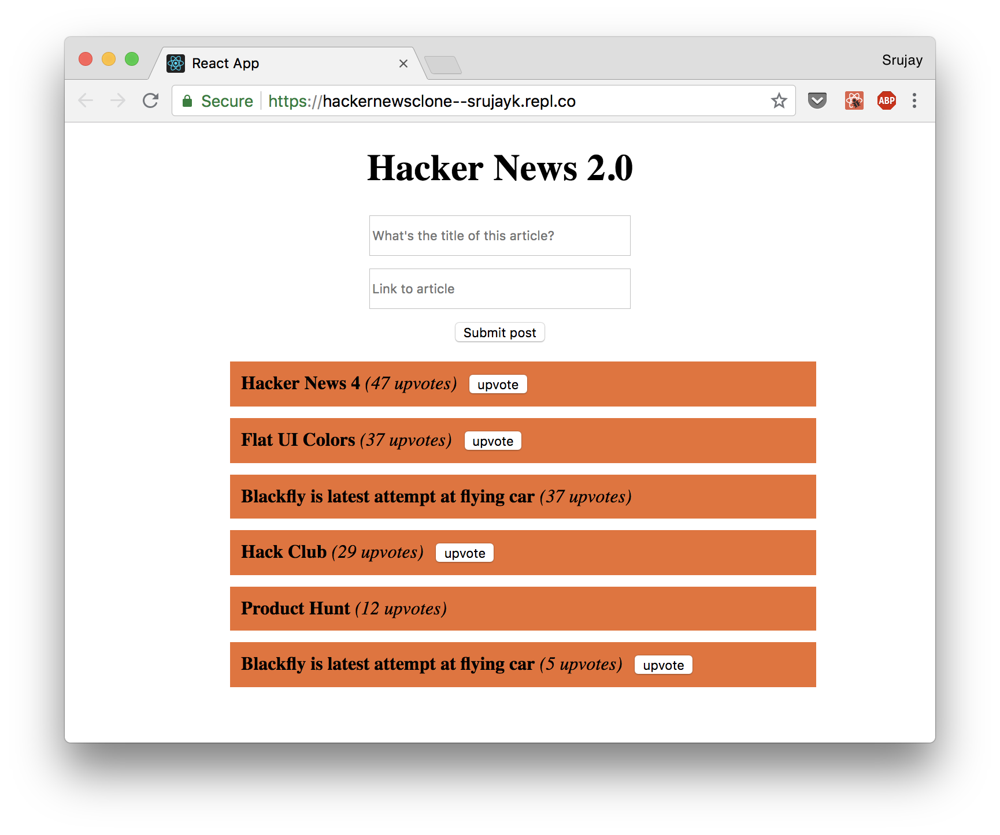
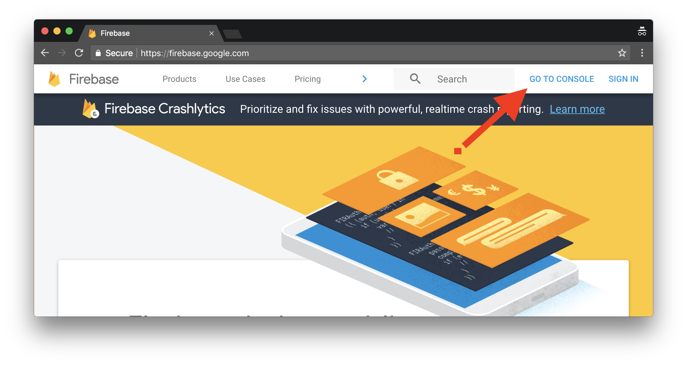
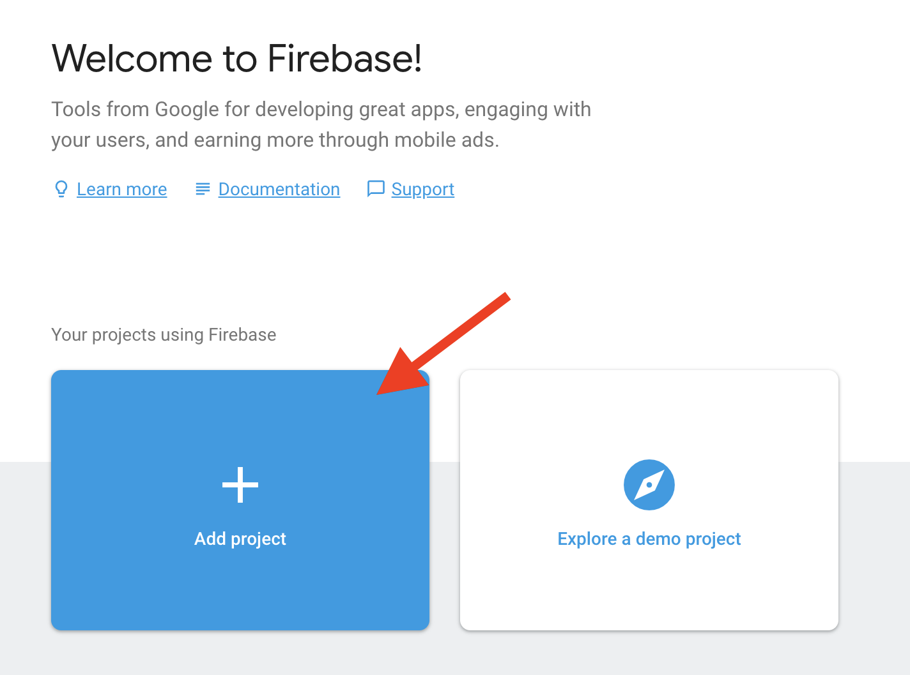
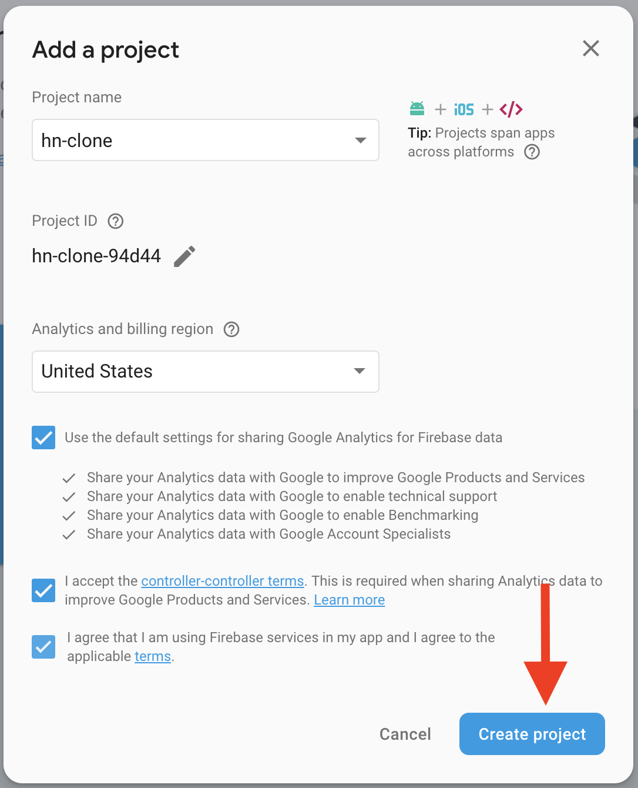
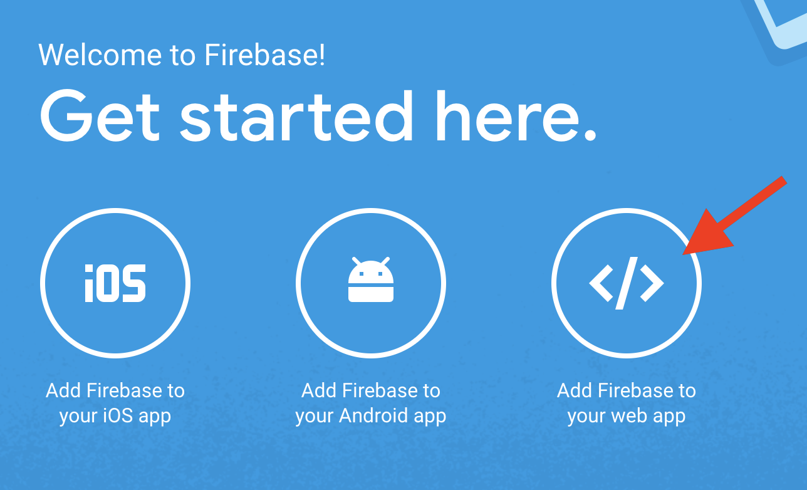
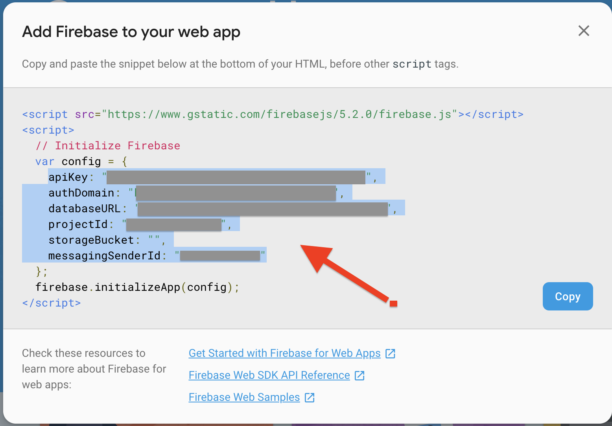
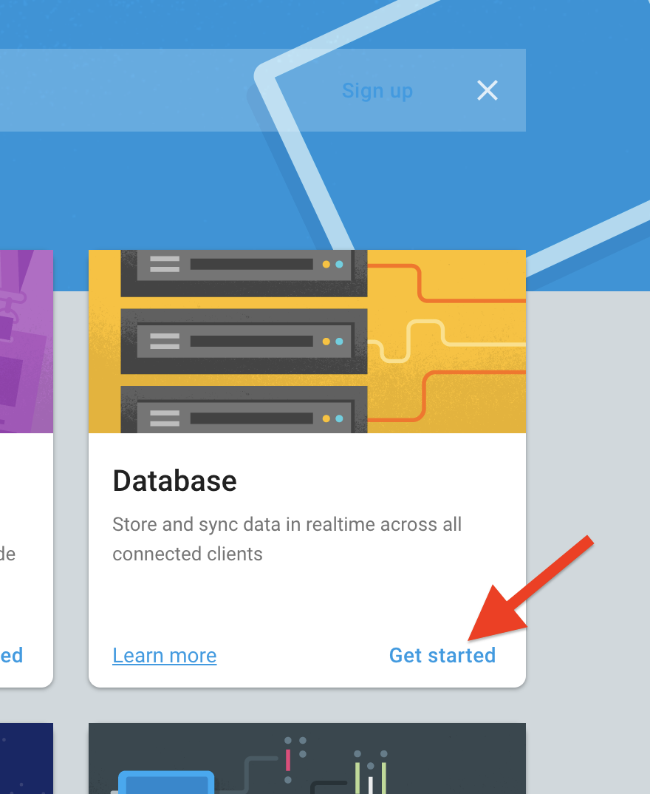
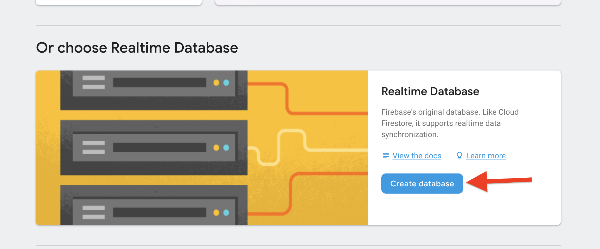
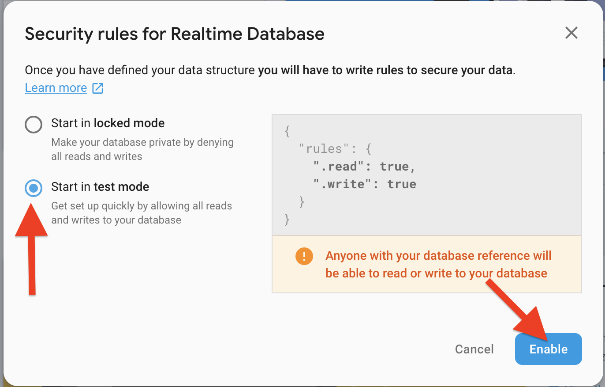
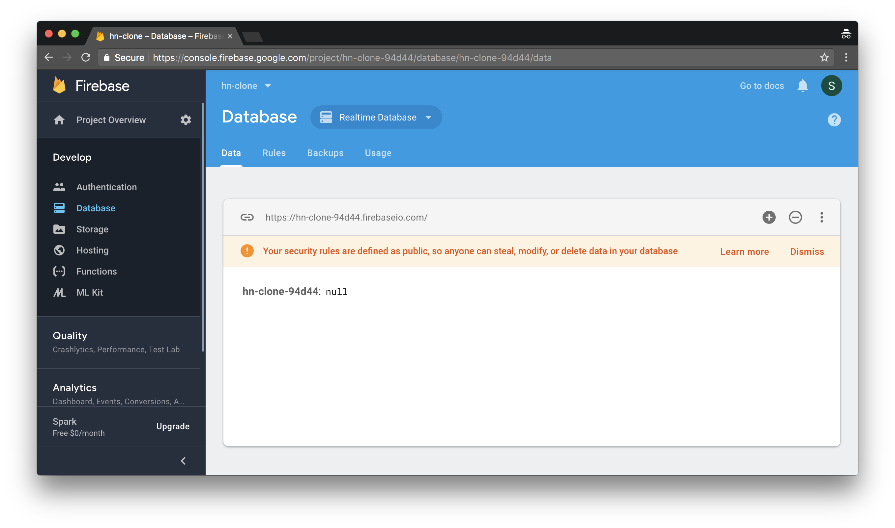

# Hacker News 2.0

_**We recommend going through this workshop in Google Chrome.**_

**What we're going to building**: A clone of the popular website [Hacker News](http://news.ycombinator.com)



**Prerequisites**: HTML and CSS, Intro to React Workshop (JSX, components, props, state)

**What you'll learn in this workshop**: Advanced React (handling forms, component lifecycles, displaying lists, conditional rendering) and Firebase

**How long this workshop will take**: 1 hour

As you know from the last workshop, React is a JavaScript library for building user interfaces for web apps. Firebase is a platform developed by [Google](http://google.com) that allows us to have a backend, or database, for our application. We're going to be building a Hacker News clone, using React to submit/display/upvote posts, and Firebase to store our data.

[Live Demo/Final Code](https://repl.it/@srujayk/hackernewsclone)

**Table of contents:**

- [Part I: Setup](#part-i-setup)
- [Part II: Layout](#part-ii-layout)
- [Part III: Submitting Posts](#part-iii-submitting-posts)
- [Part IV: Displaying Posts](#part-iv-displaying-posts)
- [Part V: Upvoting Posts](#part-v-upvoting-posts)
- [Part VI: Hacking](#part-vi-hacking)

## Part I: Setup

### Repl.it
To get your environment set up, head over to [Repl.it](http://repl.it) and create an account or log in.

Then, go to [this Repl](https://repl.it/@srujayk/hackernewsclone-blank), which contains some basic starter code for this workshop. Click the **fork** button near the top menu to create a copy of this code that you can start editing.

### Firebase
To get set up with Firebase, first head over to [firebase.google.com](http://firebase.google.com), and click **Go to Console** in the top right.



Sign in with your Gmail account, and then click **Add Project** on the next page.

<div style="text-align:center">
    
</div>


A box will pop up. There, enter a **Project name**, accept the terms and conditions, and click **Create Project**.

<div style="text-align:center">
    
</div>

You're in! Under the heading "Get started here", click **Add Firebase to your web app**.

<div style="text-align:center">
    
</div>

On the box that pops up, copy the ***highlighted part***, as show in the following picture. It should be all of the lines *inside* the curly braces of `config`. Copy those lines, and head over to your project Repl. On the sidebar, open the file `firebase.js`, and paste those lines *in between* the `//START` and `//END`.

<div style="text-align:center">
    
</div>

Go back to Firebase, and close that dialog box. Scroll down, and click **Get started** in the **Database** section.

<div style="text-align:center">
    
</div>

Scroll down until you see a section like the one pictured below, and in that section click **Create database**.

<div style="text-align:center">
    
</div>

On the dialog box that pops up, click the option for **Start in test mode**, then click **Enable**.

<div style="text-align:center">
    
</div>

Great! You're all set up for Firebase! Your page should now look like this:


This is our database, where all of the posts people submit to Hacker News clone will show up. It's empty now, but not for long!

## Part II: Layout

In this section, we're going to build a basic layout of our site.

### 1) Creating the Component

To start off, let's create a component for all of our code to go in. Head over to Repl, and open the `App.js` file. Create a component called `App`, and create the `constructor` and `render` methods.

Inside the `render` method, create a `div` element (don't forget the rules for multi-line JSX!) and inside that, create a header using `h1` that says "Hacker News 2.0".

At this point, your code should look something like this:

```js
import React, { Component } from 'react';
import firebase from './firebase.js';
import './App.css';

class App extends React.Component {
    constructor(props) {
        super(props);
    }

    render() {
        return (
            <div>
                <h1>Hacker News 2.0</h1>
            </div>
        );
    }
}

export default App;
```
The reason we don't need to call `ReactDOM.render` in this file is because we `export` our `App` component in this file, and `import` it in our `index.js` file. That's where we call `ReactDOM.render`.

### 2) The Submission Form

In the `div` element we just created, we're now going to add a form so that users for our site can submit their own links. It'll be two text boxes, one for the title of the site and one for the link, and then a submit button. Underneath the `h1`, type the following code:

```html
<form>
    <input type="text" placeholder="Article Title" />
    <input type="text" placeholder="Article Link" />
    <button>Submit post</button>
</form>
```


## Part III: Submitting Posts

Here, we're going to connect our form to Firebase, so that any time we submit, the new article title and link is stored in our Firebase database. But first, we need to learn how forms work in React.

---
### Lesson: Forms

Typically, in HTML, a tag like `<input>` controls its own state. That means that any time you type something into the field, the value is stored and maintained by HTML itself. For us to be able to use what our users enter in the form in React (which is where we'll be writing the code to add the post to Firebase), we need to have React control it's state. By doing this, we're making `input` a *controlled component*. Let's make it happen.

---

### 1) Adding a `state`

The first thing we'll need to do is create a place to store what's entered into our form in React. Naturally, we'd store this kind of thing in our component's `state`.

In the `constructor` method, add a `state` that stores two values, `formTitle` and `formLink`. Have them store empty strings for now.

```js
this.state = {
    formTitle: '',
    formLink: ''
};
```

### 2) Syncing our `input` fields to our `state`: Part 1

To sync our `input` fields to our component's state, we have to do two things: connect each field with it's corresponding value in `this.state`, and update `this.state` whenever something new is added to the field.

The first thing we'll do is add a `value` attribute to each of our input tags. Add `value={this.state.formTitle}` as an attribute to the first field, and `value={this.state.formLink}` to the second.

```html
<form>
    <input type="text" placeholder="Article Title" value={this.state.formTitle} />
    <input type="text" placeholder="Article Link" value={this.state.formLink} />
    <button>Submit post</button>
</form>
```

This will display what's stored in `this.state` as the value in each of the fields. One problem: our `this.state` is never changed because we never update it! This brings us to the next step: updating `this.state` when new input is entered. To do this, we're going to need to learn about events in React.

---
### Lesson: Events

An *event* in React occurs when one of the elements on the page is interacted with in some way. `onClick`, `onSubmit`, and `onChange` are some events in React, and are attributes of the element they impact. For example, a `button` class could have an `onClick` attribute, that calls a particular method when it's clicked.

```html
<button onClick={this.handleClick} />
```

In the example above, the method that is triggered by the `onClick` event is `handleClick`. This method is called the *event handler* method, and is called every time that particular button is clicked.

```js
handleClick(e) {
    alert('You clicked the button.');
}
```

In this case, the `handleClick` method alerts the user with a pop-up dialog, telling them they clicked the button. The input `e` to the function contains some useful information that we can use, such as the element that triggered the event.

---

### 3) Syncing our `input` fields to our `state`: Part 2

Let's get back to our form.

Before creating our event handler method or adding an event, we need a way to reference each of our `input` tags in React. The way to do it is to add another attribute: `name`. Add `name="formTitle"` and `name="formLink"` as attributes to the first and second `input` tags, respectively.

```html
<form>
    <input type="text" name="formTitle" placeholder="Article Title" value={this.state.formTitle} />
    <input type="text" name="formLink" placeholder="Article Link" value={this.state.formLink} />
    <button>Submit post</button>
</form>
```

Now, we can create an event handler method. Create a method called `handleInput` that takes an input `e`, inside our component. Inside, we're going to use `this.setState` to set our `state` to the value in the input field that was typed in.

```js
handleInput(e) {
    this.setState({
        e.target.name: e.target.value
    });
}
```
As mentioned before, the `e` input to our handler method gives us valuable information about the event. In our method, we used `e.target`, which lets us access attributes of the element (`<input>`) that triggered the event. For example, `e.target.name` gives us the `name` attribute, and `e.target.value` gives us the `value` attribute of the `input` element.

Notice how the `name` attribute of each `input` tag is the same as it's corresponding value in `this.state`. This is why using `e.target.name` in `setState` helps us. When entering text in the `input` element with `name="formTitle"`, `setState` sets the `formTitle` value in `this.state` equal to that input tag's value (`e.target.value`). When entering text in the other `input` element, with `name="formLink"`, the `formLink` value in `this.state` is updated. This lets us make one method that dynamically handles input for both `input` tags, instead of having to make a separate method for each.

The last step for our event handler method is to bind it. In the constructor, add the following line to the end:

```js
this.handleInput = this.handleInput.bind(this);
```

Finally, our event handler method is done. Now we just need to add an `onChange` event to our `input` tags, so that `handleInput` can be called each time the text inside the field is changed:

```html
<form>
    <input type="text" name="formTitle" placeholder="Article Title" value={this.state.formTitle} onChange={this.handleInput} />
    <input type="text" name="formLink" placeholder="Article Link" value={this.state.formLink} onChange={this.handleInput} />
    <button>Submit post</button>
</form>
```

### 4) Adding submitted posts to Firebase

To add our posts to Firebase, we're going to need another event handler method: this time, it'll be called any time we click the submit button on our page.

Let's create a method called `handleSubmit`, that again takes `e` as an input.
```js
handleSubmit(e) {

}
```
The first thing we need to do is prevent users from submitting an empty form, so our Firebase database is not full of blank posts. Add `e.preventDefault();` to `handleSubmit` so this doesn't happen.
```js
handleSubmit(e) {
    e.preventDefault;
}
```
Now, we need to actually connect to our database. We do this by creating a *reference* to the database. In our code, let's create a reference to a *node* called `posts`, which is where all the posts will be stored. (Check out the [Firebase documentation](https://firebase.google.com/docs/database/web/structure-data) on references and nodes to learn more.)
```js
handleSubmit(e) {
    ...
    const postsRef = firebase.database().ref('posts');
}
```
We now need post information to send to Firebase. Let's create a variable do do that, using the form data from `this.state`, and setting the initial number of `upvotes` to 0.
```js
handleSubmit(e) {
    ...
    const post = {
        title: this.state.formTitle,
        link: this.state.formLink,
        upvotes: 0
    };
}
```
Now that all of it is in one place, we can *push* it to Firebase using the reference we created earlier. (Here are the [Firebase docs](https://firebase.google.com/docs/database/web/read-and-write) on writing data.)

```js
handleSubmit(e) {
    ...
    postsRef.push(post);
}
```
***Add something to show firebase new node***

Now that we've done that, we can clear our input fields so they're ready for someone to send another post.

```js
handleSubmit(e) {
    ...
    this.setState({
        formTitle: "",
        formLink: ""
    });
}
```
Last step for this method: bind it. Add `this.handleSubmit = this.handleSubmit.bind(this);` to your constructor.

Now, we need to tell our `form` that when the submit button is clicked, `handleSubmit` should run. Add `onSubmit={this.handleSubmit}` as an attribute to your `form`.

```html
<form onSubmit={this.handleSubmit}>
    ...
</form>
```

That's it! We can now submit new posts to our Hacker News clone.

## Part IV: Displaying Posts

We're going to want a way to display our posts every time the page loads and refresh every time a new post is submitted. For that, let's learn about *component lifecycles*.

---
### Lesson: Component Lifecycles

A component's lifecycle is the different stages it goes through when being created and displayed. Some examples of stages a component can go through:

- **Mounting**: when a component is created and rendered
- **Updating**: when a component's props or state change after the initial render
- **Unmounting**: when a component is removed from the page

It can be useful in React to be able to execute certain code based on where a component is in it's lifecycle. To make it easier, React has *lifecycle methods*, which are optional methods for your component that automatically run at each stage. A few are listed below:

- `componentDidMount()`: called after component is created and rendered
- `componentWillUnmount()`: called before a component is removed
- `componentDidUpdate()`: called after a component's props or state are updated

Check out the [React docs](https://reactjs.org/docs/react-component.html) if you want to learn more about the component lifecycle.

---

Let's use our component's lifecycle to retrieve posts and display them.

### 1) Storing posts in `this.state`

The first thing we're going to do is read all the posts in Firebase and store them in `this.state`.

In `this.state`, add an empty array called `posts` that we can use to store posts we get.
```js
this.state = {
    ...
    posts: []
}
```

We're going to want to pull all of the posts from Firebase every time our component renders. What lifecycle method should we use (you can refer to the lesson above)?

If you said `componentDidMount()`, you're right! In your component, add the `componentDidMount()` method. After that, we need to create a reference to the `posts` node in Firebase just like we did in `handleSubmit`.

```js
componentDidMount() {
    const postsRef = firebase.database().ref('posts');
}
```

Now we need to actually get all of the posts from Firebase.

```js
componentDidMount() {
    ...
    postsRef.on('value', (snapshot) => {
        let rawPosts = snapshot.val();
    });
}
```
This code might look confusing, but it's not hard to understand. Basically, this code is going to the database reference given by `postsRef`, and getting a `snapshot` of all the data that's there. We get the post data from the `snapshot` using `snapshot.val()`, and we're storing that in a variable called `rawPosts`.

The next step is to clean up the data that's given to us in `rawData`, so it makes it easy for us to format it later. Add more code underneath the `rawPosts` variable:

```js
componentDidMount() {
    ...
    postsRef.on('value', (snapshot) => {
        ...
        let finalPosts = [];
        for (let post in posts) {
            newState.push({
                id: post,
                title: posts[post].title,
                link: posts[post].link,
                upvotes: posts[post].upvotes
            });
        }
    });
}
```

Whew. That was a lot. Let's break it down:

```js
1. let finalPosts = [];
```

First, we're creating an empty array called `finalPosts` where we can store our final posts.

```js
2.  for (let post in rawPosts) {
        finalPosts.push({
            id: post,
            title: rawPosts[post].title,
            link: rawPosts[post].link,
            upvotes: rawPosts[post].upvotes
        });
    }
```
This loops over each `post` in `rawPosts`, and creates a JSON object for it that contains its `id` (a unique ID that Firebase generated for each post), `title`, `link`, and `upvotes`. Then, it uses `finalPosts.push()` to add that object to `finalPosts` array. In the end, `finalPosts` has an entry for each post that we got from Firebase, nicely formatted for us.

Finally, we can set the `posts` array that we created in `this.state` equal to `finalPosts` using `this.setState()`.

```js
componentDidMount() {
    ...
    this.setState({
        posts: finalPosts
    });
}
```
Now all of our nicely formatted `post` objects are stored in `posts`. Now we can display them on the page! For reference, the completed `componentDidMount` method is shown below:

```js
componentDidMount() {
    const postsRef = firebase.database().ref('posts');
    postsRef.on('value', (snapshot) => {
        let rawPosts = snapshot.val();
        let finalPosts = [];
        for (let post in rawPosts) {
            finalPosts.push({
                id: post,
                title: rawPosts[post].title,
                link: rawPosts[post].link,
                upvotes: rawPosts[post].upvotes
            });
        }
        this.setState({
            posts: finalPosts
        });
    })
}
```


### 2) Displaying posts on the pages

To display the posts, we're going to use an HTML list (`ul`), with a separate item (`li`) for each post in `posts`. First, let's learn how to use `map`, and how to display lists in React, which will be super useful.

---
### Lesson: `map`

JavaScript has a built-in function, `map`, that makes it easy to perform a specific action on every item in an array.

For example, let's say we had an array called `even` with some even numbers.

```js
let even = [0, 2, 4, 6, 8];
```
Now, say we wanted to add 1 to each of element of `even`. We could use a `for` loop and loop over each element:

```js
let odd = [];
for (let num in even) {
    odd.push(num + 1);
}
```
But there's a better way. Using `map` and  *arrow-functions*, we can turn all this code into one line:
```js
let odd = even.map((num) => {return num + 1});
```
Looks simpler, right? In this line, there are a couple things going on.

```js
1. (num) => {return num + 1}
```
This part of the code is an arrow function in JavaScript. Arrow functions are just like normal functions (they take in an input and return some output), but are defined in a more concise way. This one takes in an input of `num`, and returns `num + 1`.

```js
2. even.map(num => {return num + 1});
```
Here, each value in `even` (first `0`, then `2`, then `4`, etc) is passed into the function, and the value + 1 is returned. This automatically generates an array of the returned values, and is then set equal to the `odd` array we created.

So, in the end, `odd` is equal to `[1, 3, 5, 7, 9]`, all in one line!

Click to read more about [`map`](https://developer.mozilla.org/en-US/docs/Web/JavaScript/Reference/Global_Objects/Array/map) and [arrow functions](https://developer.mozilla.org/en-US/docs/Web/JavaScript/Reference/Functions/Arrow_functions).


---
### Lesson: Displaying Lists in React

In JSX, a JavaScript array of `li` elements can be easily displayed as in a `ul`.

For example, say we had a JavaScript array of programming languages.

```js
const names = ["<li>JavaScript</li>", "<li>Python</li>", "<li>Java</li>"];
```

To input this into a `ul` in JSX, all we have to do is this:
```html
<ul> {names} </ul>
```

This is equivalent to this:
```html
<ul>
    <li>JavaScript</li>
    <li>Python</li>
    <li>Java</li>
</ul>
```

---

Let's get started! We're going to combine the power of `map` and displaying lists in JSX to make displaying our posts super easy.

First, let's add a `ul` after the `form` in our `render` method. Inside, we'll use `map` to automatically create an `li` element for each post.

```js
<ul>
    {this.state.posts.map((post) => {
        return (
            <li key={post.id}>
                <p>
                    <a target="_blank" href={post.link}> {post.title} </a>
                    <em>({post.upvotes} upvotes)</em>
                </p>
            </li>
        )
    })}
</ul>
```

Here, we use `map` so that we return a list of `li` elements, one for each `post` in `posts`. Each `li` element will have all of it's post's properties (`post.link`, `post.title`, `post.upvotes`) properly displayed on the page. The `target="_blank"` is just an attribute of `a` that makes links open in a new tab.

The `key` attribute for our `li` is a required part of displaying lists in React. Keys help React identify which items have been changed, added, removed. The `key` must be a unique ID that identifies each item, so we can use `post.id`, which was a unique ID for each post that Firebase generated for us.

That's it! We can now see all the posts that have been added on our page!

## Part V: Upvoting Posts

Now that our posts are on the page, we can go ahead and finish up with the upvote functionality. Our posts already have an upvote count, but there's no way to change it! Let's start by adding a button next to each post.

In our `render` method, inside the `li` element for each post, add a `button` that says "upvote".

```js
<li key={post.id}>
    <p>
        ...
    </p>
    <button>
        upvote
    </button>
</li>
```

We need to do two things when this button is pressed: update the upvote count for the post in Firebase, and remove the upvote button from the page so that the user can only click it once.

### 1) Updating the upvote count in Firebase

We'll start by creating another method called `handleUpvote`, which takes an inputs `postId` and `prevCount`, which are the ID of the post that was upvoted, and the previous number of upvotes the post had.

```js
handleUpvote(postId, prevCount) {

}   
```

Now, we're going to create a Firebase reference to the post with an id of `postId`, then `set` it's `upvotes` value to `prevCount + 1`.

```js
handleUpvote(id, prevCount) {
    const postsRef = firebase.database.ref('posts' + postId + '/upvotes').set(prevCount + 1);
}
```

Now add an `onClick` attribute to the `button` we created to call `handleUpvote` and pass in the post ID and upvote count.

```js
<button onClick={() => this.handleUpvote(post.id, post.upvotes)}>
    ...
</button>
```

Now, if you click the button, the upvote count gets updated on the page and in Firebase! But the upvote button doesn't disappear, so someone could upvote something as many times as they want. Let's fix that by learning about *conditional rendering*.

---
### Lesson: Conditional rendering

Sometimes, you may want a component/element to render only if certain conditions are met. For example, if a variable `x` is `true`, then show a picture of a dog on the page, but if `x` is `false`, show a picture of a cat. There are three ways to do this in React.

#### 1. Regular `if/else` statement

The first is just a basic `if` statement:
```js
render() {
    if (x === true) {
        return <DogPicture />;
    } else {
        return <CatPicture />;
    }
}
```
The drawbacks of this just an if statement is that it can't be used within JSX. So if you wanted to render a whole page, but only one element is different based on the value of `x`, you'd have a lot of duplicate code.

#### 2. Inline `if/else` statement

A second option is to use an inline if statement. This *can* be used in JSX, so it's a lot more useful. The way it works:

```
condition ? renders if condition is true : renders if x is false
```
Here's example:

```js
render() {
    return (
        <div>
            <h1>Hi!</h1>
            <p>This is a cool paragraph.</p>
            {x === true ? <p>x is true</p> : <p>x is false</p>}
        </div>
    );
}
```
Say `x` is `true`. This code would display "Hi", "This is a cool paragraph.", and "x is true". If `x` is `false`, it would display "Hi", "This is a cool paragraph.", and "x is false".

You'd use this if you want to display an one element if the condition is true, but *a different* element if the condition is false.

#### 3. Inline `if` statement using `&&`

The last conditional rendering method is using an `&&`, and *can* be used within JSX. The way this works:

```
{ condition && renders if condition is true }
```

Using the same example of `x`,

```js
render() {
    return (
        <div>
            <h1>Hi!</h1>
            <p>This is a cool paragraph.</p>
            { x === true && <p>x is true</p> }
        </div>
    );
}
```
If `x` is `true`, the code would display "Hi", "This is a cool paragraph.", and "x is true". If `x` is `false`, it would display only "Hi" and "This is a cool paragraph.".

This is pretty much the same as using the inline if statement, but doesn't run anything if the condition is false. You'd use this if you either want to display an element if the condition is true, or *nothing* if it's false.

---

We're going to use conditional rendering to only display the upvote button if the user hasn't already upvoted the post. To do this, we have to keep track of which posts the user has upvoted already.

In `this.state`, add an empty array named `upvoted`, which we'll use to keep track of upvoted posts.

```js
constructor(props) {
    ...
    this.state = {
        ...
        posts: [],
        upvoted: []
    };
}
```

Now we need to make sure that when a post is upvoted, it gets added to the `upvoted` array. In our `handleUpvote` method, add the following code:

```js
handleSubmit(postId, prevCount) {
    ...
    this.setState({
        upvoted: this.state.upvoted.concat(postId);
    });
}
```

Whenever a post is upvoted, it's `postId` now gets added to the `upvoted` array. Now that we know what posts are upvoted, we can use conditional rendering to only display posts that *haven't* been upvoted (meaning their `postId` *won't* be in `upvoted`). See if you can figure out which conditional rendering method would work best for this.

While you could use any of the 3 methods, the inline if using `&&` would work best, since it's good for either showing or hiding a particular element based on a condition. We're going to wrap our `<button>` in curly braces `{}`, and use the following condition:

```js
this.state.upvoted.indexOf(post.id) === -1
```

The `indexOf()` method can determine if a particular element is present in a list. Click [here](https://developer.mozilla.org/en-US/docs/Web/JavaScript/Reference/Global_Objects/Array/indexOf) to learn more.

Your `render` method should now look like this:

```js
render() {
    return (
        <div>
            ...
            {this.state.upvoted.indexOf(post.id) == -1 &&
             (<button onClick={() => this.handleUpvote(post.id, post.upvotes)}>
                upvote
              </button>)}
        </div>
    );
}
```

Now when you click the **upvote** button, it increases the upvote count, then disappears!

We're done! You now have your own Hacker News!

## Part VI: Hacking
